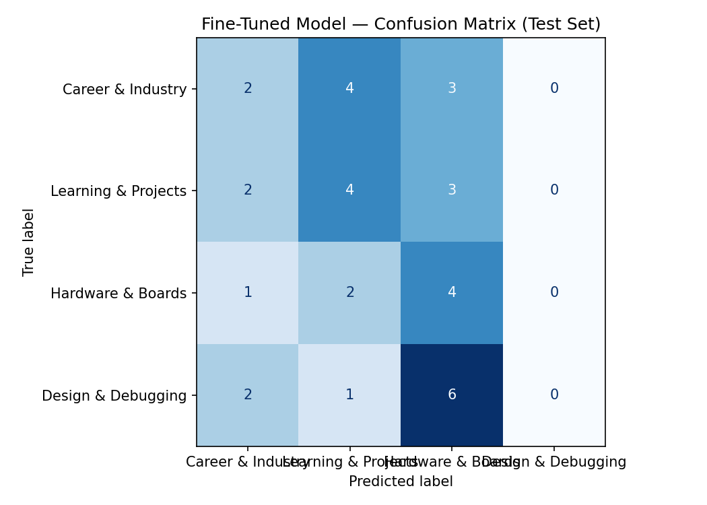

# TakeMeter: Fine-Tuning DistilBERT for FPGA Reddit Post Classification

**AI201 – Project 3**

---

# Project Overview

TakeMeter is a supervised text classification project that categorizes FPGA-related Reddit posts into four discussion categories. The project compares a zero-shot Large Language Model (LLM) classifier against a fine-tuned DistilBERT classifier trained on a manually annotated FPGA Reddit dataset.

The objective was to determine whether fine-tuning a lightweight transformer on a relatively small domain-specific dataset could outperform a strong zero-shot baseline.

---

# Community Choice and Reasoning

The FPGA Reddit community was selected because it contains diverse technical discussions covering career advice, hardware platforms, project ideas, and debugging questions. These discussions naturally form a multi-class text classification problem while remaining within a focused engineering domain.

Automatic categorization of these discussions could support knowledge management, content recommendation, community moderation, and technical search.

---

# Problem Statement

FPGA Reddit discussions cover multiple themes that often overlap in vocabulary. The goal of this project is to automatically classify each Reddit post into one of four predefined categories using supervised learning and compare the performance of a fine-tuned transformer model with a zero-shot LLM baseline.

---

# Dataset

The dataset contains **222 manually annotated FPGA Reddit posts** collected from FPGA-related Reddit discussions.

Dataset location:

```text
data/FPGA_Reddit_Dataset_1_222.csv
```

The official notebook created the following stratified split:

| Dataset    | Examples |
| ---------- | -------: |
| Training   |      155 |
| Validation |       33 |
| Test       |       34 |

---

# Data Collection and Labeling Process

Posts were collected from FPGA-related Reddit discussions and manually reviewed before annotation.

Each post was assigned exactly one label according to the taxonomy defined in `planning.md`.

The annotation process emphasized:

* Primary discussion intent
* Consistent application of label definitions
* Manual review of ambiguous cases
* Consistency across similar posts

No labels were automatically accepted without manual verification.

---

# Label Taxonomy

## Career & Industry

Posts discussing careers, interviews, internships, hiring, salaries, recruiters, or FPGA jobs.

Examples:

* Technical interview at Graphcore for design position
* Career as an FAE for FPGA

---

## Learning & Projects

Posts focused on tutorials, beginner questions, educational resources, learning experiences, or FPGA project ideas.

Examples:

* Some cool things I can do with an FPGA board
* Newbie given an FPGA board

---

## Hardware & Boards

Posts discussing FPGA development boards, evaluation kits, peripherals, hardware selection, or hardware migration.

Examples:

* Custom FPGA board bringup
* I have previously worked with Artix-7. I have to get familiarised with the VPK180 Versal board.

---

## Design & Debugging

Posts discussing Verilog/VHDL coding, synthesis, implementation, timing analysis, simulation, or debugging.

Examples:

* What is wrong with this Verilog?
* Difficulty with getting Yosys simulation to work

---

# Label Distribution

| Label               | Examples |
| ------------------- | -------: |
| Career & Industry   |       56 |
| Learning & Projects |       60 |
| Hardware & Boards   |       50 |
| Design & Debugging  |       56 |
| **Total**           |  **222** |

The dataset is reasonably balanced across the four classes.

---

# Difficult Annotation Decisions

### Example 1

**Post**

> Technical interview at Graphcore for design position

Decision:

Although the word **design** appears, the primary discussion concerns employment and interviewing. Therefore the post was labeled **Career & Industry**.

---

### Example 2

**Post**

> Newbie given an FPGA board

Decision:

This post could reasonably belong to **Hardware & Boards** or **Learning & Projects**. It was labeled **Learning & Projects** because the discussion focuses on beginning FPGA learning rather than evaluating hardware.

---

### Example 3

**Post**

> I have previously worked with Artix-7. I have to get familiarised with the VPK180 Versal board.

Decision:

Although learning is mentioned, the discussion primarily concerns FPGA hardware platforms and board migration. Therefore it was labeled **Hardware & Boards**.

---

# Fine-Tuning Approach

The project fine-tuned **DistilBERT (`distilbert-base-uncased`)** using Hugging Face Transformers on Google Colab with a T4 GPU.

Training configuration:

| Parameter     | Value |
| ------------- | ----- |
| Epochs        | 3     |
| Learning Rate | 2e-5  |
| Batch Size    | 16    |
| Weight Decay  | 0.01  |
| Warmup Steps  | 50    |

The official notebook defaults were used throughout the experiment. No hyperparameters were modified.

---

# Zero-Shot Baseline

The baseline classifier used **Llama-3.3-70B-Versatile** through the Groq API.

The system prompt defined the four labels, provided label descriptions and examples, and instructed the model to return **only the label name** for each Reddit post.

Each test example was classified individually and evaluated using overall accuracy together with precision, recall, and F1-score.

---

# Evaluation Results

## Zero-Shot Baseline

### Overall Accuracy

**73.5%**

### Per-Class Metrics

| Label               | Precision | Recall |   F1 |
| ------------------- | --------: | -----: | ---: |
| Career & Industry   |      1.00 |   0.56 | 0.71 |
| Learning & Projects |      0.54 |   0.78 | 0.64 |
| Hardware & Boards   |      0.71 |   0.71 | 0.71 |
| Design & Debugging  |      0.89 |   0.89 | 0.89 |

---

## Fine-Tuned DistilBERT

### Overall Accuracy

**29.4%**

### Per-Class Metrics

| Label               | Precision | Recall |   F1 |
| ------------------- | --------: | -----: | ---: |
| Career & Industry   |      0.29 |   0.22 | 0.25 |
| Learning & Projects |      0.36 |   0.44 | 0.40 |
| Hardware & Boards   |      0.25 |   0.57 | 0.35 |
| Design & Debugging  |      0.00 |   0.00 | 0.00 |

---

# Fine-Tuned Confusion Matrix

| True Label          | Predicted Career | Predicted Learning | Predicted Hardware | Predicted Design |
| ------------------- | ---------------: | -----------------: | -----------------: | ---------------: |
| Career & Industry   |                2 |                  4 |                  3 |                0 |
| Learning & Projects |                2 |                  4 |                  3 |                0 |
| Hardware & Boards   |                1 |                  2 |                  4 |                0 |
| Design & Debugging  |                2 |                  1 |                  6 |                0 |



---

# Baseline vs Fine-Tuned Comparison

| Model                 |  Accuracy |
| --------------------- | --------: |
| Zero-shot Baseline    | **73.5%** |
| Fine-Tuned DistilBERT | **29.4%** |

Overall regression:

**44.1 percentage points**

---

# Sample Classifications

| Reddit Post                                                                                     | Predicted Label     | Confidence |
| ----------------------------------------------------------------------------------------------- | ------------------- | ---------: |
| Technical interview at Graphcore for design position                                            | Learning & Projects |       0.27 |
| I have previously worked with Artix-7. I have to get familiarised with the VPK180 Versal board. | Learning & Projects |       0.28 |
| What is wrong with this Verilog?                                                                | Hardware & Boards   |       0.27 |
| Some cool things I can do with an FPGA board                                                    | Learning & Projects |       0.27 |

The correctly classified project-related example is reasonable because the discussion explicitly asks about FPGA project ideas, matching the intended definition of **Learning & Projects**.

---

# Error Analysis

### Error 1

**Career & Industry → Learning & Projects**

The model appears to have associated the word **design** with technical project work rather than recognizing the employment context.

---

### Error 2

**Hardware & Boards → Learning & Projects**

The classifier focused on the phrase **get familiarised** instead of recognizing that the discussion primarily concerns FPGA hardware platforms.

---

### Error 3

**Design & Debugging → Hardware & Boards**

The classifier confused debugging terminology with FPGA hardware discussions, suggesting that the debugging decision boundary was not successfully learned.

---

# AI-Assisted Pattern Analysis

An AI assistant was used to summarize recurring patterns among the misclassified examples.

The suggested patterns included:

* Debugging posts confused with hardware discussions.
* Career posts containing technical vocabulary confused with project discussions.
* Hardware posts containing learning-oriented language confused with Learning & Projects.

These observations were verified manually using the confusion matrix, prediction outputs, and individual examples before being included in this report.

An earlier hypothesis that the model had collapsed into predicting a single class was discarded after rerunning the notebook from a fresh Colab runtime. The final reported results are based solely on the complete rerun.

---

# Reflection

The intended behavior was for the classifier to distinguish the underlying purpose of each Reddit discussion rather than relying solely on FPGA terminology.

Instead, the fine-tuned model appeared to learn overlapping vocabulary more readily than the semantic distinctions defined during annotation. While the classifier partially learned the **Learning & Projects** and **Hardware & Boards** categories, it failed to learn the **Design & Debugging** decision boundary.

---

# Spec Reflection

### How the specification helped

The milestone-based specification provided a structured workflow that emphasized careful annotation, baseline evaluation before training, systematic experimentation, and detailed error analysis rather than focusing only on model accuracy.

### Where implementation diverged

The initial Google Colab runtime disconnected during experimentation. To maintain consistency, the notebook was rerun from the beginning. All reported metrics, confusion matrices, and exported evaluation artifacts correspond to the final complete execution.

---

# AI Usage

### Example 1

AI was used to review the label definitions, discuss annotation edge cases, and improve consistency across manually labeled Reddit posts.

Final annotation decisions were made manually.

### Example 2

AI assisted in interpreting evaluation metrics, analyzing confusion matrix patterns, and identifying recurring themes among model misclassifications.

All AI-generated observations were manually verified before inclusion in the evaluation report.

---

# Repository Structure

```text
data/
    FPGA_Reddit_Dataset_1_222.csv

results/
    confusion_matrix.png
    evaluation_results.json

planning.md
README.md
```

---

# Future Work

Future improvements include:

* Hyperparameter tuning
* Larger annotated datasets
* Data augmentation
* Alternative transformer architectures
* Additional training epochs
* Better separation between Hardware & Boards and Design & Debugging

---

# Lessons Learned

This project demonstrated that fine-tuning a transformer on a relatively small domain-specific dataset does not necessarily outperform a strong zero-shot LLM. Careful evaluation, confusion matrix analysis, and systematic error analysis are essential for understanding model behavior beyond overall accuracy.

The project also reinforced the importance of reproducibility. After a Colab runtime interruption, the entire experiment was rerun so that all reported results originated from one consistent execution.


## Confusion Matrix


# Demo Script 

This demonstration addresses the four required items for the project demo.

---

## 1. Show 3–5 Posts Being Classified by the Fine-Tuned Model

### Classification 1 (Correct Prediction)

**Post**

> Some cool things I can do with an FPGA board.

**Predicted Label:** Learning & Projects

**Confidence:** 0.27

This prediction is correct because the post is asking about FPGA project ideas and learning opportunities. The primary intent is educational, which matches the Learning & Projects category.

---

### Classification 2

**Post**

> Technical interview at Graphcore for design position.

**Predicted Label:** Hardware & Boards

**Confidence:** 0.26

---

### Classification 3

**Post**

> I have a problem with synthesis.

**Predicted Label:** Hardware & Boards

**Confidence:** 0.26

---

### Classification 4

**Post**

> I have previously worked with Artix-7. I have to get familiarised with the VPK180 Versal board.

**Predicted Label:** Learning & Projects

**Confidence:** 0.26

---

## 2. One Correct Prediction with Explanation

The correctly classified example is:

> Some cool things I can do with an FPGA board.

The model predicted **Learning & Projects** with a confidence score of **0.27**.

This prediction is reasonable because the post discusses FPGA project ideas and learning activities. It does not focus on debugging, hardware comparison, or career advice, so Learning & Projects is the appropriate category.

---

## 3. One Incorrect Prediction with Explanation

The incorrect example is:

> Technical interview at Graphcore for design position.

The true label is **Career & Industry**, but the model predicted **Hardware & Boards** with a confidence score of **0.26**.

This prediction is incorrect because the discussion is about a technical job interview rather than FPGA hardware. The model appears to have focused on the technical word *design* instead of recognizing that the overall context is employment and career development.

---

## 4. Brief Walkthrough of the Evaluation Report

The zero-shot Groq baseline achieved an overall accuracy of **73.5%**, while the fine-tuned DistilBERT model achieved **29.4%** accuracy on the same test set.

The confusion matrix summarizes the model's predictions. The rows represent the true labels, while the columns represent the predicted labels. The diagonal entries correspond to correctly classified posts, whereas the off-diagonal entries represent misclassifications.

The model correctly classified:

* **2 of 9** Career & Industry posts.
* **4 of 9** Learning & Projects posts.
* **4 of 7** Hardware & Boards posts.
* **0 of 9** Design & Debugging posts.

The confusion matrix shows that most **Design & Debugging** posts were misclassified as **Hardware & Boards** or **Learning & Projects**. This explains why the Design & Debugging category obtained an **F1-score of 0.00**.

Overall, the zero-shot baseline outperformed the fine-tuned model on this dataset. The results suggest that additional labeled examples, improved label definitions, and hyperparameter tuning would likely improve the model's performance in future work.
